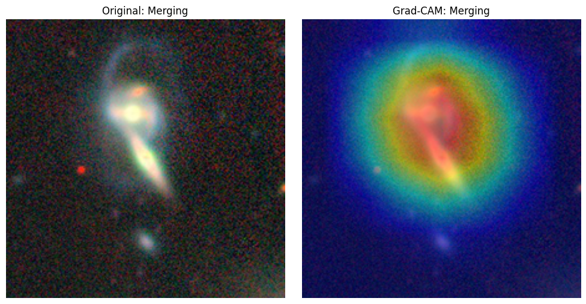

# AstralAI

An explainable AI platform for astronomical image analysis.
MCA final-year capstone project.

## Status
🚧 Week 2 complete — the Week 1 model is now served over HTTP.
Week 1 proved the ML pipeline: galaxy morphology classification
(ResNet18 + Grad-CAM) on Galaxy10 DECaLS, ~72% validation accuracy
across 10 classes, with interpretable heatmaps landing on real
galaxy structure.



## Stack
Python · PyTorch · FastAPI · Next.js · PostgreSQL

## Inference API (Week 2)

A local FastAPI service exposing a single endpoint.

### `POST /predict`

Accepts a `multipart/form-data` upload with a `file` field containing a galaxy
image (PNG or JPEG). Returns:

```json
{
  "predicted_class": "Merging",
  "confidence": 0.87,
  "heatmap": "<base64-encoded PNG of the Grad-CAM overlay>"
}
```

`heatmap` is raw base64 with no data-URI prefix — a browser client should
prepend `data:image/png;base64,`.

### Setup

The trained weights are **not** in this repo (a 45 MB binary does not belong in
git history). Download `galaxy10_resnet18.pth` from Google Drive
(`MyDrive/astralai/galaxy10_resnet18.pth`, produced by `AstralAI_Week1.ipynb`)
and place it at `backend/models/galaxy10_resnet18.pth`.

```bash
cd backend
python -m venv .venv
.venv\Scripts\python.exe -m pip install -r requirements.txt
```

CPU-only is fine — single-image inference takes well under a second.

### Run

```bash
cd backend
.venv\Scripts\python.exe -m uvicorn main:app --reload
```

Open <http://localhost:8000/docs> for the auto-generated Swagger UI and upload
an image there.

To test the model without the web layer at all:

```bash
.venv\Scripts\python.exe inference.py test_images\val_02385_c01_Merging.png
```

That prints the predicted class and confidence, and writes `gradcam_out.png`.

Test images are not committed (regenerate them, they are derived data). See
`backend/test_images/README.md` for the Colab cell that exports labelled
validation galaxies — the ground-truth class is encoded in each filename, so a
prediction can be checked for correctness rather than mere plausibility.

### Layout

```
backend/
├── models/galaxy10_resnet18.pth   # gitignored — download separately
├── inference.py                   # model loading, prediction, Grad-CAM
├── main.py                        # FastAPI app
└── requirements.txt
```

`inference.py` contains no web code and `main.py` contains no ML code, so the
model can be tested independently of the server.

## Roadmap
- [x] Repo setup
- [x] Galaxy classifier + Grad-CAM (Week 1)
- [x] FastAPI inference endpoint (Week 2)
- [ ] Web UI + upload flow
- [ ] Research dashboard
- [ ] AI astronomy assistant
- [ ] *Stretch:* exoplanet light-curve detector
